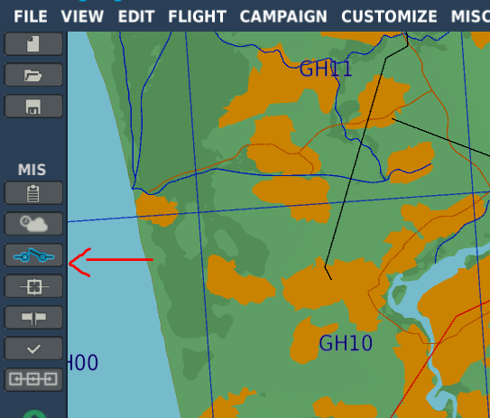
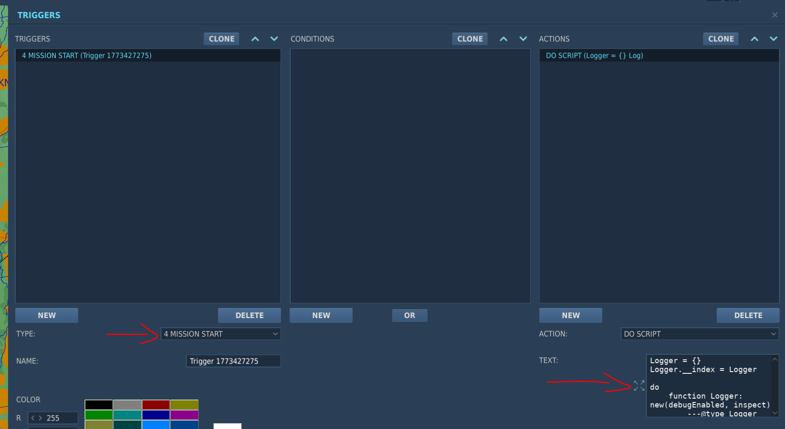

# DCS WW2 dogfight trainer
Following the release of the La-7, I decided to throw together a script to help test its performance against the other units in DCS.

The sample mission included uses the Caucasus map, and contains all player-flyable units with air spawns set at 2km and 8km altitude.

## Usage
Use the communication menu - F10 Other and spawn an enemy unit, or set spawning options

F10 - 1: Spawn unit(s)
- Random unit(s): spawns 1 or more unit randomly
- Select <faction> fighter(s): select and spawn fighter unit belonging to the country/faction
- Select bomber(s)/transport: select and spawn from the list of bombers and transport planes

F10 - 2: Spawn options
- Select spawn location:
    - **Random**: units spawn on a random heading from the player, keeping distance and aspect settings in mind
    - **In front of player**
    - **Behind player**
- Select spawn distance:
    - **5km**
    - **10km**
    - **15km**
    - **20km**
    - **25km**
    - **50km**
- Select enemy aspect:
    - **Random**: selects randomly from hot/cold/flank options each spawn
    - **Hot**
    - **Cold**
    - **Flank left**
    - **Flank right**
- Select spawn skill:
    - **Random**: selects randomly from average/good/high/excellent each spawn
    - **Average**
    - **Good**
    - **High**
    - **Excellent**
- Select amount:
    - **1**
    - **2**
    - **3**
    - **4**
- Disable MW50
    - Disable water tank contents for P-47 and Bf 109. Menu item only appears if enabled
- Enable MW50 (in supported units)
    - Enable water tank contents for P-47 and Bf 109. Menu item only appears if disabled
- Delete enemies
    - Despawn all enemy units currently spawned
- Nudge AI
    - It's possible the AI might lose sight of the player and give up until the player is spotted again. Select this menu item to try and nudge it into fighting again. If it doesn't do the trick after 3 tries, chase or despawn the enemy.

## Modifying the mission
The script only works in single player and does not rely on specific group or unit names.
Feel free to modify the existing mission or add the script to a new one.

### Adding the lua script to a new mission
1: open triggers

2a: add "Mission Start" trigger 
2b: select "DO SCRIPT" and copy/paste the script

